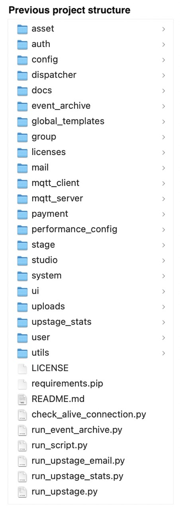

# Project structure change migration guide - AnchorSteam-2.0.3

The purpose is to make the newcomers easier to understand what UpStage is composed of and the configuration & documentation on how to set up things more obvious.

|           Previous Project Structure            |           New Project Structure            |
| :---------------------------------------------: | :----------------------------------------: |
|  |  |

Summary: most of the current folders you see on the old structure would be inside `core` folder, which is the `upstage.service` modules. Config folder stays unchanged, it's where all configurations should be put, and it got flattened for easier access & modification. Start scripts, such as `run_*.py`, are moved inside scripts folder. And we are moving the Vue projects to the upper level.

## Migration guide

After checking out the version, `git status` output should be like this:

```bash
cd ~/upstage
git status

# Untracked files:
# (use "git add <file>..." to include in what will be committed)
# config/settings/
# ui/
```

`ui/` are just `node_modules` and `dist`, which are ignored by git and can be safely removed and installed later:

```bash
mv ui/dashboard/.env* dashboard/
rm -rf ui
cd dashboard
yarn
yarn build
cd ../studio
yarn
yarn build
```

Move our configuration file (**the most important file**) to the flattened `config` folder:

_Please replace `app1.py` with `<your_hostname>.py`_

```bash
cd ~/upstage
mv config/settings/app1.py config/
```

Update the upstage services in `systemd`:

_Please replace `prod` with `dev` if you are migrating dev instances_

```bash
sudo ln -sf /home/upstage/upstage/config/prod/upstage.service /etc/systemd/system/upstage.service
sudo ln -sf /home/upstage/upstage/config/prod/upstage_event_archive.service /etc/systemd/system/upstage_event_archive.service
sudo ln -sf /home/upstage/upstage/config/prod/upstage_email_token.service /etc/systemd/system/upstage_email_token.service
sudo systemctl daemon-reload
sudo systemctl restart upstage
sudo systemctl restart upstage_event_archive
sudo systemctl restart upstage_email_token
```

Update uploaded assets:

```bash
ln -s /home/upstage/assets_all_releases uploads/assets
```

Update `nginx` config:

_Please replace `prod/app1` with `dev/dev_app1` if you are migrating dev instances_

```bash
sudo ln -sf /home/upstage/upstage/config/prod/app1_nginx_upstage.conf /etc/nginx/sites-available/upstage.conf
sudo systemctl restart nginx
```
